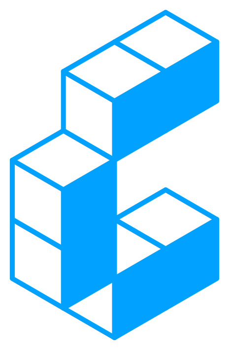

# Constructive Brand Kit

<p align="center" width="100%">
  
</p>

<p align="center" width="100%">
  <a href="https://github.com/constructive-io/brand-kit/actions/workflows/ci.yml">
    
  </a>
  <a href="./LICENSE"></a>
</p>

The open-source brand kit for [Constructive](https://constructive.io): the mark, its mathematical derivation,
colors, type, usage rules, and the code that generates every asset.

The Constructive mark is **constructed, not drawn**. It is a C made of six unit cubes projected isometrically. That
single voxel description is the source of truth — the SVGs, the OBJ/MTL meshes, the WebGL render on the site, and the
cube alphabet are all derived from it by the packages in this repository. Read [DESIGN.md](./DESIGN.md) for the
system itself.

## Packages

| Package                                       | What it does                                                                        |
| --------------------------------------------- | ----------------------------------------------------------------------------------- |
| [`@constructive-io/brand-geometry`](./packages/geometry)   | Pure math: isometric projection, planes, voxel models, face culling, the palette |
| [`@constructive-io/brand-logo`](./packages/logo)           | The mark: `MARK_GRID`, `MARK`, `renderMark()` → SVG, `exportMark()` → OBJ/MTL |
| [`@constructive-io/brand-font`](./packages/font)           | The cube alphabet: `textToVoxels()`, `renderText()`, `exportText()` |
| [`@constructive-io/brand-svg`](./packages/svg)             | Deterministic SVG renderer (`filled`, `outline`, `wireframe`) and per-cube animation frames |
| [`@constructive-io/brand-3d`](./packages/3d)               | Quad mesh → OBJ + MTL: six complete unit cubes, one `g cube_N` group each, `top`/`left`/`right` materials |
| [`@constructive-io/brand-motion`](./packages/motion)       | Choreographies (`explode`, `assemble`, `converge`, `orbit`, `tetris`), composition (`chain`, `mirror`, `layer`) and multi-act `reels` |
| [`@constructive-io/brand-motion-2d`](./packages/motion-2d) | Choreography → SVG frame sequences, self-contained animated SVG (SMIL), sprite sheets |
| [`@constructive-io/brand-motion-3d`](./packages/motion-3d) | Choreography → three.js: `CubeScene`, brand materials, iso/free/path cameras and `cameraPaths` (orbit, sweep, dolly…) |
| [`@constructive-io/brand-cli`](./packages/cli)             | `brand-kit svg \| obj \| frames \| generate` — the CLI that writes `assets/generated` |
| [`apps/site`](./apps/site)                                  | Vite + React + three.js site: WebGL mark, derivation, lockups, palette, playground, motion studio, showreel |

## Assets

- [`assets/official/`](./assets/official) — the official lockups (mark, horizontal, vertical; dark/white/brand
  backgrounds) as used on constructive.io. Use these as-is.
- [`assets/generated/`](./assets/generated) — regenerated by `pnpm generate` and checked in CI. Colorways, render
  modes, every isometric plane, the cube alphabet, OBJ/MTL for the mark and the cube wordmark, and stills plus
  animated SVGs for each motion family and reel.

## Motion

Every animation is a pure function `(model, t) → state per cube`; the SVG and three.js renderers consume the same
states. Reels chain families into multi-act loops. The previews below are the checked-in animated SVGs:

| build · breathe · scatter | orbit in / out | print · wave | pulse |
| --- | --- | --- | --- |
|  |  |  |  |


| explode | assemble | converge | orbit | tetris |
| --- | --- | --- | --- | --- |
|  |  |  |  |  |

## Quick start

```sh
pnpm install
pnpm build        # builds packages, then the site
pnpm test
pnpm lint
pnpm generate     # regenerate assets/generated from the geometry
pnpm dev          # site at http://localhost:5173
```

Requires Node.js 22+ and pnpm 12+.

## Usage

```ts
import { colorways } from '@constructive-io/brand-geometry';
import { MARK, renderMark, exportMark } from '@constructive-io/brand-logo';
import { renderText, exportText } from '@constructive-io/brand-font';
import { choreography } from '@constructive-io/brand-motion';
import { animatedSvg, sequence } from '@constructive-io/brand-motion-2d';

const { svg } = renderMark({ colors: colorways.light });               // the mark
const { obj, mtl } = exportMark({ colors: colorways.solid });          // as a mesh

renderText('BUILD', { mode: 'outline' });                              // cube type
exportText('BUILD');

const choreo = choreography('explode', 'spiral');                      // motion
sequence(MARK, choreo, { frames: 48 });                                // numbered SVG frames
animatedSvg(MARK, choreo, { duration: 2, playback: 'bounce' });        // one SMIL-animated SVG
```

```sh
brand-kit svg mark --colorway dark --out mark-dark.svg
brand-kit svg text BUILD --mode wireframe
brand-kit obj grid 011/100/100/011 --plane Yz --out ./out
brand-kit frames mark --family tetris --preset cascade --frames 48 --out ./frames
brand-kit generate --out assets/generated
```

## The math, in one screen

```
grid  (row, col) ∈ {0,1}^{4×3}         MARK_GRID = [[0,1,1],[1,0,0],[1,0,0],[0,1,1]]
lift  plane 'Yz':  (row, col) ↦ (x, y, z) = (0, −col, −row)
cube  every filled cell is a unit cube at that lattice point
cull  faces shared by two cubes are removed
project (x, y, z) ↦ ( (x − y)·√3⁄2 · s ,  (x + y)·½ · s − z · s )
sort  painter's depth = x + y + z, back to front
faces only +z (top), +y (left), +x (right) can face the camera
```

## Supply-chain policy

This workspace is managed by [pnpm-policy](https://www.npmjs.com/package/pnpm-policy): a two-day minimum release
age for third-party packages and an explicit allow-list for install scripts. Edit `pnpm-policy.yaml`, run
`pnpm policy`, and CI runs `pnpm policy:check`.

## Credits

Geometry and the cube alphabet originate in Constructive's internal logo experiments; lockups and palette come from
[constructive.io](https://constructive.io). Built with [pgpm](https://github.com/constructive-io/pgpm) boilerplates.
